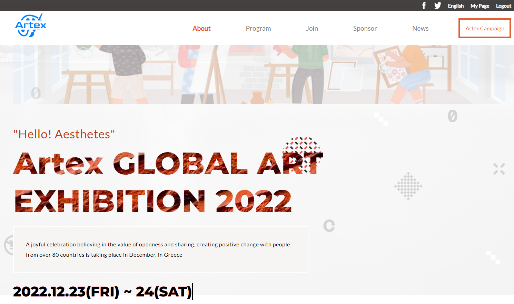
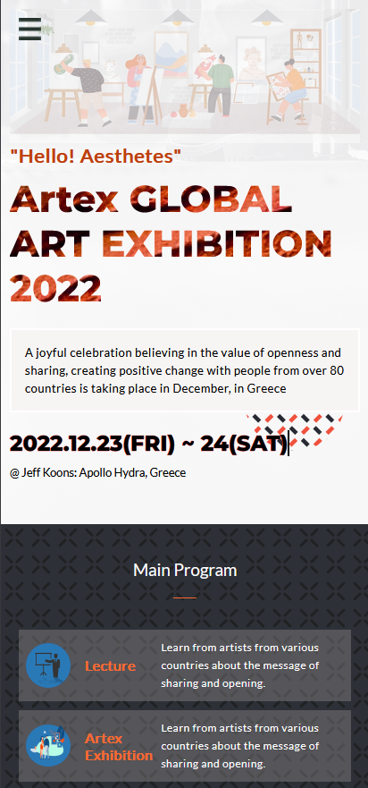

# Project Name

> Capstone project from module-1

## Built With

- HTML , CSS & JavaScript

## Getting Started

For this project i designed a website with two pages a homepage and an about
page;

- Homepage: Dispalys the following interfaces;
  - Date and time of the art exhibition.
  - Main programs planned for the event.
  - Featured speakers for the event.
- About page: Displayss the following interfaces;
  - Logo for the exhibition creaters.
  - Events from previous years.

### Setup

- Clone the project using this link:
  https://github.com/yonas44/Microverse_capstone-1

### Deployment

[Live Demo Link](https://yonas44.github.io/Microverse_capstone-1/)

### Video Description

- Here you can watch a
  [Video](https://www.loom.com/share/b0fb6fdb367c4977b428e725b08dc5c2) of me
  describing my project😊.

## Authors

👤 **Author1**

- GitHub: [@yonas44](https://github.com/yonas44)

## 🤝 Contributing

Contributions, issues, and feature requests are welcome!

Feel free to check the [issues page](../../issues/).

## Show your support

Give a ⭐️ if you like this project!

## Acknowledgments

-I want to thank [Cindy Shin](https://creativecommons.org/licenses/by-nc/4.0/)
for allowing me to use their template in designing and building this website.

## 📝 License

This project is [MIT](./MIT.md) licensed.

_NOTE: we recommend using the
[MIT license](https://choosealicense.com/licenses/mit/) - you can set it up
quickly by
[using templates available on GitHub](https://docs.github.com/en/communities/setting-up-your-project-for-healthy-contributions/adding-a-license-to-a-repository).
You can also use [any other license](https://choosealicense.com/licenses/) if
you wish._
